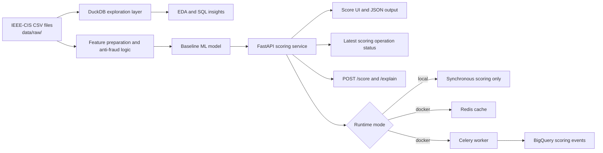
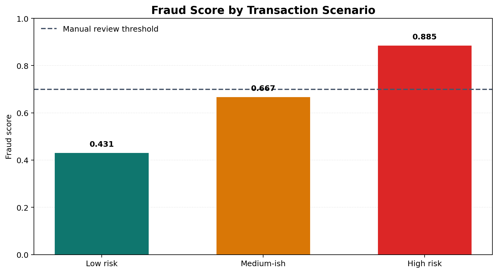
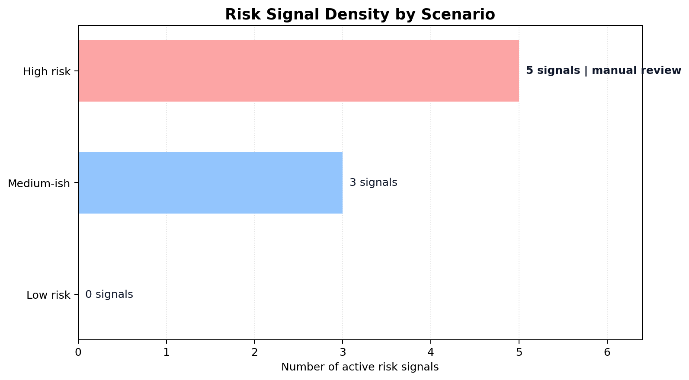
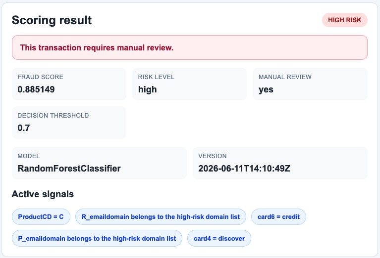
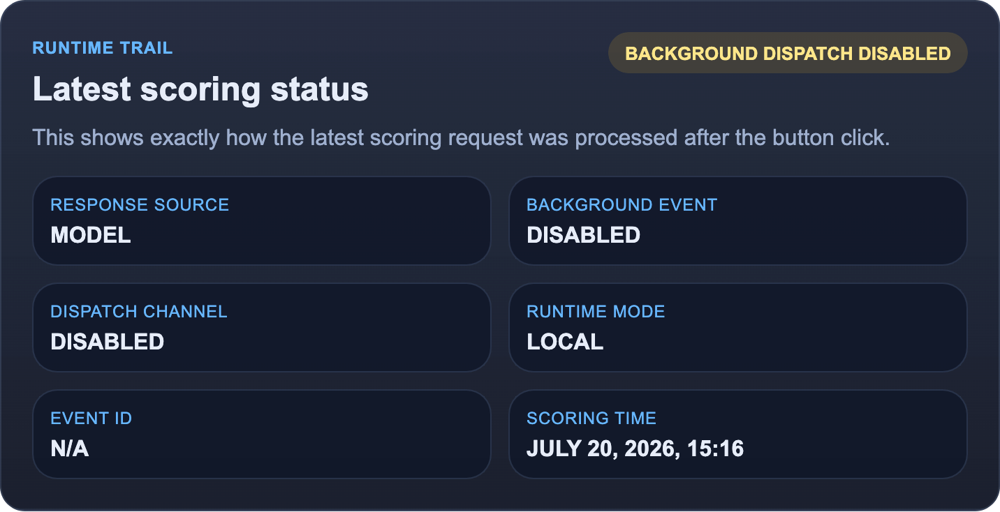
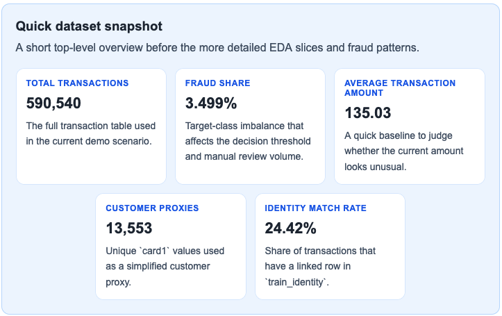
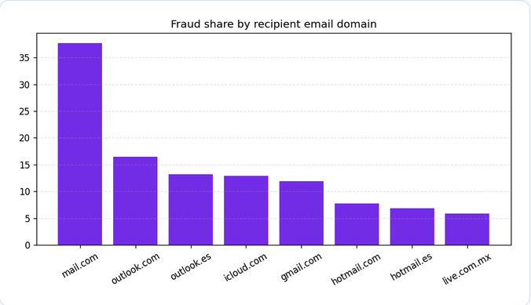
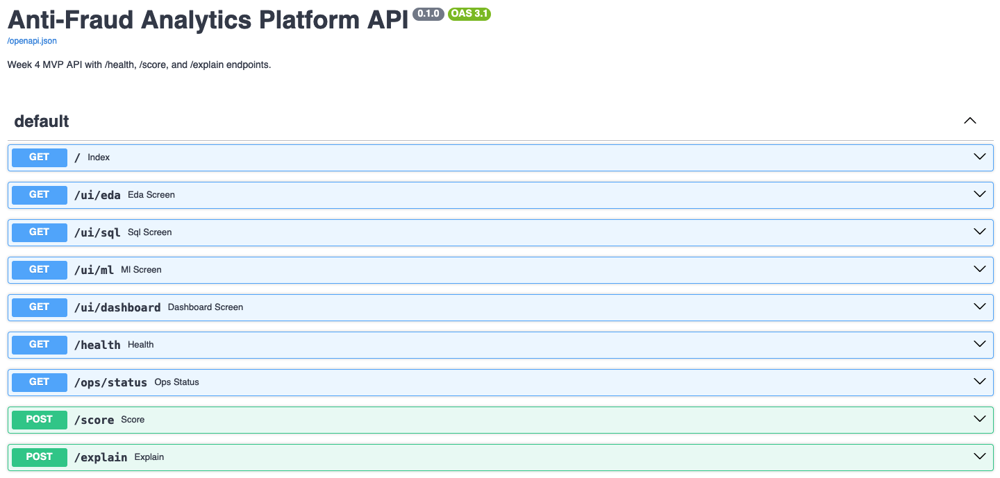
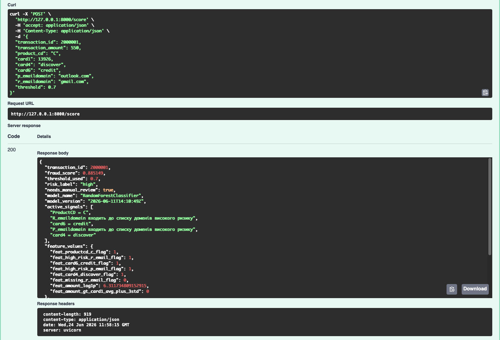

# Anti-Fraud Analytics Platform

A portfolio project focused on anti-fraud analytics, risk scoring, and decision-ready backend delivery.

- Live Demo: [https://antifraud.pp.ua/](https://antifraud.pp.ua/)


## Quick Links

- [Live Demo](https://antifraud.pp.ua/)
- [Overview](#overview)
- [Architecture](#architecture)
- [Visual Snapshot](#visual-snapshot)
- [UI Walkthrough](#ui-walkthrough)
- [API Docs Preview](#api-docs-preview)
- [Source Materials](#source-materials)
- [API Scoring Snapshot](#api-scoring-snapshot)
- [Runtime Modes](#runtime-modes)
- [Docker Stack](#docker-stack)

## Overview

This repository demonstrates an end-to-end anti-fraud workflow on top of the `IEEE-CIS` transaction dataset:

- exploratory analysis with `SQL`, `DuckDB`, and lightweight browser-ready `EDA`;
- anti-fraud hypothesis generation and interpretable risk signals;
- baseline `ML` scoring with business-facing review decisions;
- `FastAPI` delivery with a UI, API endpoints, and optional Docker infrastructure;
- Docker-only background export with `Redis`, `Celery`, and `BigQuery`.

## Architecture



## Visual Snapshot

The charts below are generated from the documented MVP scoring scenarios and are included to make the repository easier to scan as an analytics portfolio project.

<p align="center">
  
  
</p>

## UI Walkthrough

The current MVP ships with a server-rendered analyst-facing interface that combines guided demo scenarios, live scoring feedback, and lightweight `EDA` slices sourced from local data.

### Score Screen

<p align="center">
  
</p>

<p align="center">
  
</p>

The score flow is designed to show more than a raw probability:

- a business-facing risk label;
- the manual review decision;
- active fraud signals behind the prediction;
- the operational status of the most recent scoring request.

### EDA Screen

<p align="center">
  
  
</p>

The `EDA` screen keeps the demo compact while still surfacing live backend-generated insights from the local `IEEE-CIS` CSV files.

## API Docs Preview

The repository also includes a browsable `FastAPI` documentation surface that makes the scoring API easy to inspect during demos and interviews.

<p align="center">
  
</p>

<p align="center">
  
</p>

## Source Materials

This MVP is built on top of the public `IEEE-CIS Fraud Detection` dataset and the local raw CSV files derived from it.

- Kaggle dataset source: [IEEE-CIS Fraud Detection](https://www.kaggle.com/datasets/lnasiri007/ieeecis-fraud-detection?resource=download&select=train_identity.csv)
- Primary raw files used in the project:
    - `data/raw/train_transaction.csv`
    - `data/raw/train_identity.csv`
- These files power the local `DuckDB` exploration flow, the browser `EDA` views, and the anti-fraud scoring demo inputs.

## What This Project Shows

| Layer                 | What it demonstrates                                                                   |
| --------------------- | -------------------------------------------------------------------------------------- |
| Data analysis         | Transaction-level exploration, `EDA`, and suspicious pattern discovery                 |
| Analytics engineering | Reusable `SQL` slices and feature-oriented data marts                                  |
| ML baseline           | Fraud scoring, thresholds, and interpretable active risk signals                       |
| Product thinking      | Business-friendly UI cards, review decisions, and analyst-facing outputs               |
| Delivery              | `FastAPI` app, Docker packaging, async event export, and operational status monitoring |

## Project Structure

- `data/` - source data notes and local datasets;
- `sql/` - analytical queries and feature marts;
- `notebooks/` - `EDA` and exploratory notebooks;
- `src/` - data preparation, features, rules, and model code;
- `api/` - `FastAPI` app and request/response schemas;
- `docs/` - supporting materials and generated README assets;
- `scripts/` - helper scripts for cache preparation, exports, and environment smoke checks.

## Local Data

Large `IEEE-CIS` CSV files are kept locally and are not committed to GitHub.

Put the raw files here:

- `data/raw/train_transaction.csv`
- `data/raw/train_identity.csv`

The current MVP UI reads these files on the backend through `DuckDB` and renders compact result tables, summaries, and charts in the browser.

The current interface is server-rendered through `FastAPI` templates, while the longer-term target frontend stack for the project is `SvelteKit`.

To precompute the heavier `EDA` and `SQL` UI cache before starting the server:

```bash
.venv/bin/python scripts/precompute_ui_cache.py
```

## API Scoring Snapshot

The MVP API exposes two main endpoints:

- `GET /health`
- `POST /score`

To validate scoring behavior, I tested three predefined transaction scenarios through a Python `requests` client.

| Scenario   | Active Signals                                                                                        | Fraud Score | Risk Label | Manual Review |
| ---------- | ----------------------------------------------------------------------------------------------------- | ----------: | ---------- | ------------- |
| Low risk   | No binary risk flags triggered                                                                        |  `0.430693` | `low`      | `false`       |
| Medium-ish | `card6=credit`, high-risk `P_emaildomain`, missing `R_emaildomain`                                    |  `0.667183` | `low`      | `false`       |
| High risk  | `ProductCD=C`, high-risk `R_emaildomain`, `card6=credit`, high-risk `P_emaildomain`, `card4=discover` |  `0.885149` | `high`     | `true`        |

### Interpretation

These scenarios show that the MVP behaves consistently with the anti-fraud logic built into the project:

- more risk signals lead to a higher `fraud_score`;
- the API returns both a score and an operational action through `needs_manual_review`;
- the threshold (`0.7`) converts model output into a concrete review decision;
- `active_signals` make the response easier to interpret for a fraud analyst.

This moves the project beyond a notebook-only experiment and turns it into a working scoring service with both human-facing and API-facing outputs.

## Runtime Modes

The project supports two infrastructure modes:

- `local` - default mode, no `Celery`, no `Redis`, no `BigQuery`; scoring stays synchronous inside `FastAPI`;
- `docker` - container mode with `Redis` response cache and a background `Celery` worker that pushes scoring events into `BigQuery`.

If you run the app locally outside Docker, nothing changes: the existing local workflow still works without queue or cache infrastructure.

## Docker Stack

The Docker stack is designed for the heavier demo mode:

- `app` - `FastAPI` scoring API and server-rendered UI;
- `redis` - cache for repeated `/score` requests;
- `worker` - `Celery` worker that writes score events into `BigQuery` asynchronously.

### Prepare BigQuery Credentials

1. Copy `.env.docker.example` to `.env`.
2. Create the secrets directory structure if it is still empty:

```bash
mkdir -p secrets
```

3. Put your Google service account key at `secrets/gcp-service-account.json`.
4. Fill in `BIGQUERY_PROJECT_ID`, and optionally adjust `BIGQUERY_DATASET` and `BIGQUERY_TABLE`.

Expected local structure:

```text
.
├── .env
└── secrets/
    ├── .gitignore
    ├── README.md
    └── gcp-service-account.json
```

Minimal `.env` example:

```env
BIGQUERY_PROJECT_ID=your-gcp-project-id
BIGQUERY_DATASET=anti_fraud_analytics
BIGQUERY_TABLE=scoring_events
BIGQUERY_AUTO_CREATE=true
REDIS_SCORE_CACHE_TTL_SECONDS=900
ENABLE_BIGQUERY_EVENT_SINK=true
ENABLE_REDIS_SCORE_CACHE=true
```

### Start Docker Mode

```bash
docker compose up --build
```

### BigQuery Smoke Check Inside Docker

Run this after `.env` and `secrets/gcp-service-account.json` are in place:

```bash
docker compose run --rm app python scripts/bigquery_smoke_check.py
```

If everything is configured correctly, the command prints:

- `BigQuery smoke check passed`
- active `project_id`
- target `dataset`
- target `table`
- `checked_at` timestamp from BigQuery

Then open:

- `http://localhost:8000/`
- `http://localhost:8000/health`
- `http://localhost:8000/ops/status`

### Docker Notes

- `POST /score` stays synchronous and returns immediately from the API process;
- repeated identical score requests can be served from `Redis`;
- `BigQuery` persistence is offloaded to `Celery`, so the request path is not blocked by warehouse writes;
- if `BigQuery` variables are missing, the API still scores normally, but background export is skipped;
- the `Score` page shows the status of the latest scoring operation, while `GET /ops/status` exposes the broader runtime infrastructure state.
